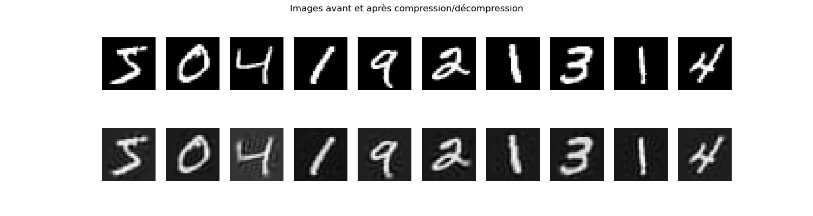

# 2D point cloud with 3 clusters

### Testing Kmeans on a 2D point cloud with 3 clusters

### Testing Kmeans on a 2D point cloud with 3 clusters

# Testing Kmeans on mnist digit dataset

### compressing the mnist digit dataset using Kmeans

