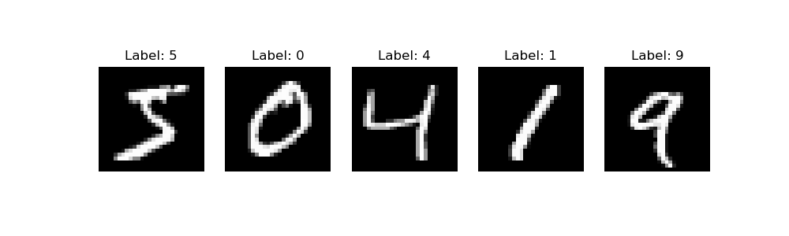

# 2D point cloud with 3 clusters

### Testing Kmeans on a 2D point cloud with 3 clusters


### Testing Kmeans on a 2D point cloud with 3 clusters




# Testing Kmeans on mnist digit dataset

### visulization of the mnist digit dataset using Kmeans


### compressing the mnist digit dataset using Kmeans

```python
def compress(self: "KMeans", image):
    image_flat = image.reshape(-1)
    image_flat = image_flat / 255.0

    id_cluster = np.argmin(np.linalg.norm(image_flat - self.centroids, axis=1))
    return id_cluster
```

### decompressing the mnist digit dataset using Kmeans

##### image before compression

##### image after decompression


### generating new images using Kmeans


##### This is done by interpolating between 2 random centroids of the clusters, in this case we can see it is the cluster of the digit 0 and 3


