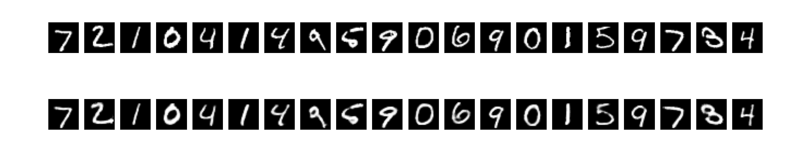

# Testing auto-encoder on mnist digit dataset

### visulization of the mnist digit dataset using auto-encoder


### compressing the mnist digit dataset using auto-encoder

```python
self.encoder = keras.models.Sequential()
self.encoder.add(layers.InputLayer(self.input_shape))
self.encoder.add(layers.Flatten())
self.encoder.add(layers.BatchNormalization())
self.encoder.add(layers.Dense(512, activation="tanh"))
self.encoder.add(layers.Dense(256, activation="tanh"))
self.encoder.add(layers.Dense(128, activation="tanh"))
self.encoder.add(layers.Dense(32, activation="sigmoid"))
self.encoder.add(layers.BatchNormalization())
self.encoder.add(layers.Dense(self.encoding_dim, activation="sigmoid"))

def compression(self, X) -> None:
    return self.encoder.predict(X)
```

### loss and validation loss of the auto-encoder


### compression et decompression of the mnist digit dataset using auto-encoder



### generation of the mnist digit dataset using auto-encoder