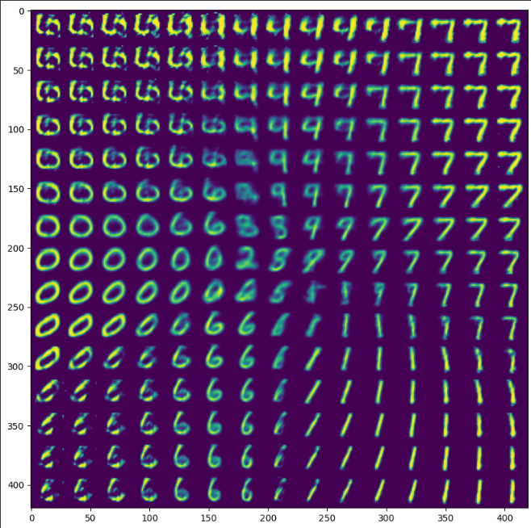

# Testing auto-encoder on mnist digit dataset
## Model
### Autoencoder (AE)
#### Encoder
```python
self.encoder = keras.models.Sequential()
self.encoder.add(layers.InputLayer(self.input_shape))
self.encoder.add(layers.Flatten())
self.encoder.add(layers.BatchNormalization())
self.encoder.add(layers.Dense(512))
self.encoder.add(layers.Activation('tanh'))
self.encoder.add(layers.Dense(256))
self.encoder.add(layers.Activation('relu'))
self.encoder.add(layers.Dense(128))
self.encoder.add(layers.Activation('relu'))
self.encoder.add(layers.Dense(32, activation="sigmoid"))
self.encoder.add(layers.BatchNormalization())
self.encoder.add(layers.Dense(2, activation="sigmoid"))
```

#### Decoder
```python
self.decoder = keras.models.Sequential()
self.decoder.add(layers.InputLayer((2,)))
self.decoder.add(layers.BatchNormalization())
self.decoder.add(layers.Dense(32, activation="tanh"))
self.decoder.add(layers.Dense(128))
self.decoder.add(layers.Activation('relu'))
self.decoder.add(layers.Dense(256))
self.decoder.add(layers.Activation('relu'))
self.decoder.add(layers.Dense(512))
self.decoder.add(layers.Dense(self.output_shape, activation='sigmoid'))
```

### Variational Autoencoder (VAE)
#### Encoder
```python
inputs = Input(shape=(original_dim,))
h = layers.Dense(intermediate_dim, activation='relu')(inputs)
z_mean = layers.Dense(self.latent_dim)(h)
z_log_sigma = layers.Dense(self.latent_dim)(h)

def sampling(args):
    z_mean, z_log_sigma = args
    epsilon = K.random_normal(shape=(K.shape(z_mean)[0], self.latent_dim), mean=0., stddev=0.1)
    return z_mean + K.exp(z_log_sigma) * epsilon

z = layers.Lambda(sampling)([z_mean, z_log_sigma])
self.encoder = Model(inputs, [z_mean, z_log_sigma, z], name='encoder')
```

#### Decoder
```python
latent_inputs = Input(shape=(self.latent_dim,), name='z_sampling')
x = layers.Dense(intermediate_dim, activation='relu')(latent_inputs)
outputs = layers.Dense(original_dim, activation='sigmoid')(x)
self.decoder = Model(latent_inputs, outputs, name='decoder')
```


## Training time
train on 10 epochs: 111s  
train on 200 epochs: 2100s

## Loss and validation loss of the auto-encoder
### Autoencoder (AE)


### Variational Autoencoder (VAE)
train on 10 epochs:  


train on 200 epochs:  


## Compression and decompression of the mnist digit dataset using variational auto-encoder
### Autoencoder (AE) 
train on 100 epochs:


### Variational Autoencoder (VAE)
train on 10 epochs:  


train on 200 epochs:  


## Visulization of the mnist digit dataset using variational auto-encoder

### Autoencoder (AE)
train on 100 epochs:


### Variational Autoencoder (VAE)
train on 10 epochs:  


train on 200 epochs:  


## Generation of the mnist digit dataset using variational auto-encoder
### Autoencoder (AE)
train on 100 epochs:

### Variational Autoencoder (VAE)
train on 10 epochs:  


train on 200 epochs:  

