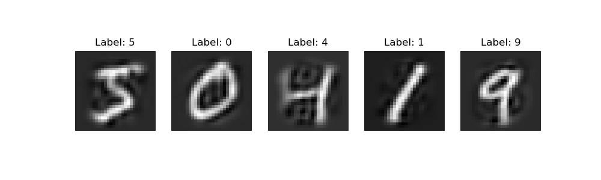

### Testing PCA on a 2D point cloud 

# Testing PCA on toy dataset with 2 components

# Testing PCA on mnist digit dataset with 64 components

### compressing/decompressing the mnist digit dataset using PCA
### Testing PCA on mnist digit dataset with 154 components who explain 95% of the variance

# Visualizing the latent space of the mnist digit dataset using PCA

### Here is a generated image of the mnist digit dataset using PCA

